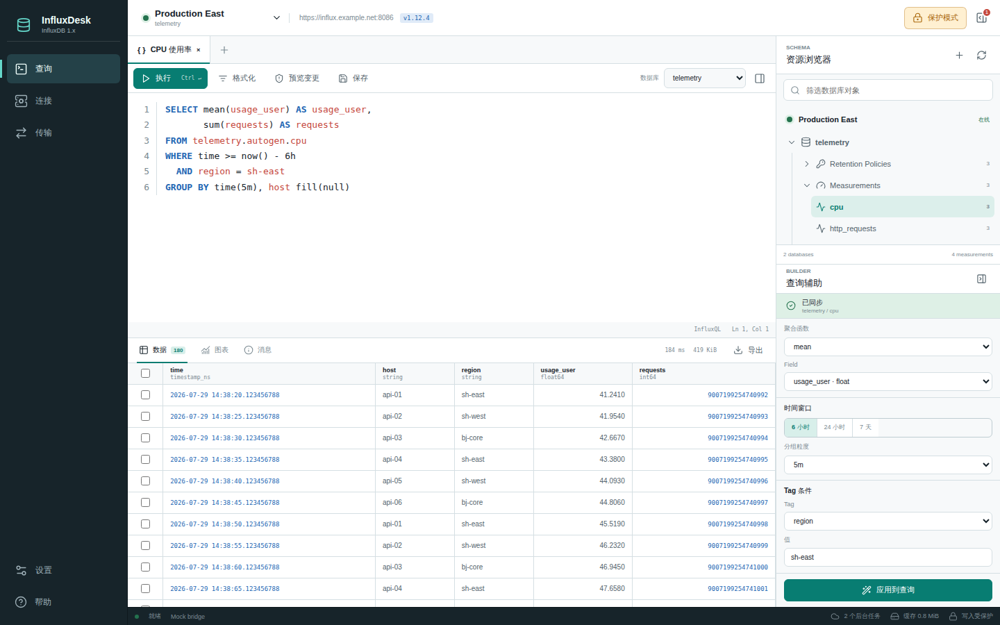
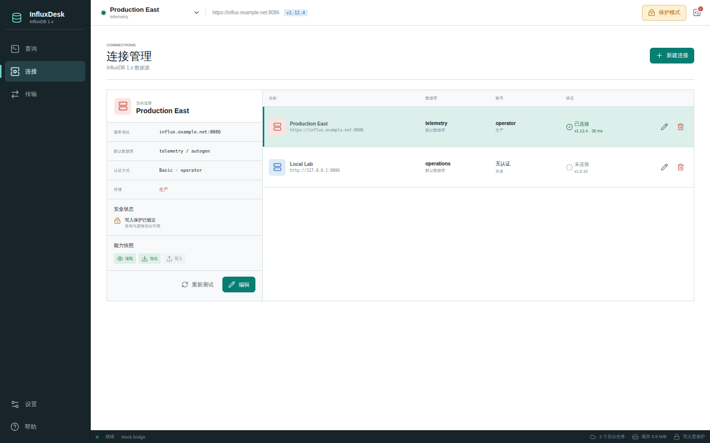
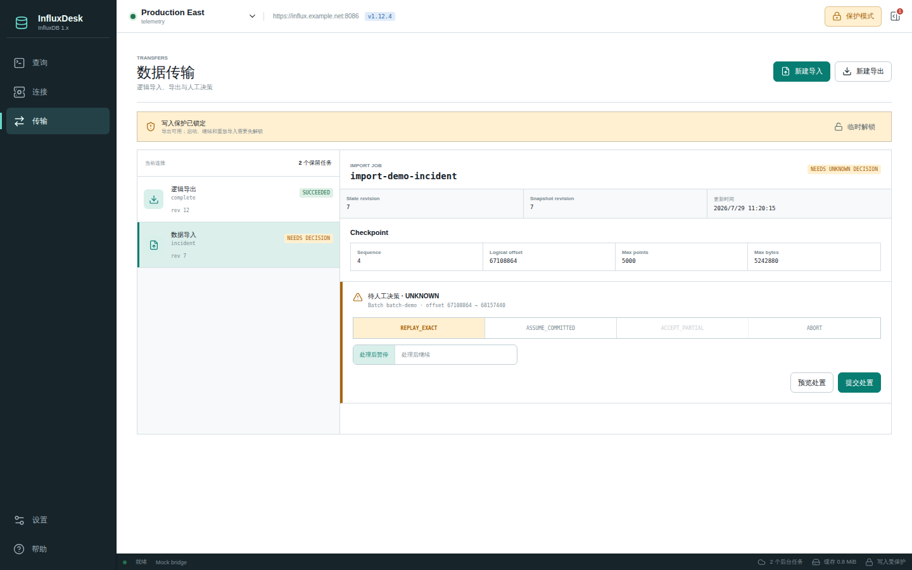

<p align="center">
  
</p>

<h1 align="center">InfluxDesk</h1>

<p align="center">
  面向 Windows 和 InfluxDB 1.x 的桌面查询与数据管理工具
</p>

<p align="center">
  <a href="https://github.com/betterball-coding/influxdbDesk/releases/tag/v0.1.0">下载 v0.1.0</a>
  ·
  <a href="https://github.com/betterball-coding/influxdbDesk/issues">问题反馈</a>
  ·
  <a href="docs/IMPLEMENTATION_STATUS.md">实现状态</a>
</p>

<p align="center">
  <a href="https://github.com/betterball-coding/influxdbDesk/actions/workflows/ci.yml"></a>
  
  
  
</p>

InfluxDesk 是一个专注于 InfluxDB 1.x 的中文桌面工作台。它把连接管理、Schema 浏览、InfluxQL 编辑、查询结果分析、受保护的数据变更，以及逻辑导入导出放在同一个 Windows 应用中，适合日常排查、数据核对和受控运维。



## 功能

- **连接管理**：集中维护多个 InfluxDB 1.x 数据源，支持连接测试、状态检查和默认数据库配置。
- **InfluxQL 工作台**：多标签编辑、语法高亮、快捷执行与取消、Schema 资源树和可视化查询辅助。
- **结果分析**：分页表格、精确数值展示、趋势图，以及所选行或完整结果的 CSV 导出。
- **安全变更**：连接默认处于写入保护状态；写操作必须先预览影响，再通过一次性授权执行。
- **逻辑导入导出**：支持 Line Protocol、CSV 和 JSONL 等导入预检，提供可恢复任务、checkpoint、分片导出与人工事故决策。
- **本地持久化**：保存连接配置、查询任务和传输状态，应用重启后可以恢复未完成任务。
- **Windows 凭据保护**：敏感连接信息通过 Windows Credential Manager、DPAPI 等系统能力保护，不写入普通日志或任务正文。

## 界面预览

### 连接管理

查看连接地址、数据库、认证方式、运行状态和当前安全能力。



### 数据传输

统一管理逻辑导入、逻辑导出、任务恢复和需要人工确认的异常批次。



## 下载

当前版本为 [v0.1.0 预发布版](https://github.com/betterball-coding/influxdbDesk/releases/tag/v0.1.0)，面向 Windows 11 x64：

| 文件 | 用途 |
| --- | --- |
| `InfluxDesk-0.1.0-windows-x64-portable.zip` | 解压后直接运行的便携版本 |
| `InfluxDesk-0.1.0-windows-x64-unsigned.msi` | Windows x64 安装包 |
| `SHA256SUMS.txt` | 发布文件完整性校验 |

> v0.1.0 是功能预览版，EXE 和 MSI 尚未进行 Authenticode 商业代码签名。Windows SmartScreen 可能显示未知发布者提示，请只从本仓库 Releases 下载，并在运行前核对 SHA-256。

### 系统要求

- Windows 11 x64，建议 23H2 或 24H2。
- Microsoft Edge WebView2 Evergreen Runtime。
- InfluxDB OSS 1.8.10 或 1.12.4；1.7.10 作为兼容性目标。
- 仅支持 InfluxQL 和 InfluxDB 1.x HTTP API，不支持 Flux、SQL、InfluxDB 2.x/3.x。

## 快速开始

1. 从 Releases 下载便携 ZIP 或 MSI，并核对 `SHA256SUMS.txt`。
2. 解压运行 `InfluxDesk.exe`，或通过 MSI 完成安装。
3. 打开“连接”，填写 InfluxDB 地址、端口、账号和默认数据库。
4. 测试并打开连接，在 Schema 面板选择 measurement 后编写 InfluxQL。
5. 保持“保护模式”即可安全执行只读查询和逻辑导出；写操作需要显式解锁并完成预览确认。

## 安全边界

- InfluxDesk 的导入导出属于**逻辑数据传输**，不是 InfluxDB 服务端备份、快照或灾难恢复工具。
- 写操作默认锁定；永久只读连接不能通过界面升级为可写连接。
- 查询结果中的大整数和高精度数值以文本语义保留，图表仅使用显式的非权威数值投影。
- v0.1.0 尚未完成商业代码签名、完整 Windows VM 安装生命周期和真实生产环境认证，不应直接作为无人值守生产发布。

更完整的实现范围、测试门禁和未完成事项见 [docs/IMPLEMENTATION_STATUS.md](docs/IMPLEMENTATION_STATUS.md)。

## 本地开发

工具链：Go 1.25.12、Node.js 22.22.2、Wails 2.13.0。

```bash
cd frontend
npm ci
npm test
npm run build

cd ..
go test ./...
go vet ./...
wails build -platform windows/amd64 -clean -m -nopackage -webview2 error -nocolour
```

浏览器开发模式使用确定性 mock 数据；原生 Wails 模式使用真实 Go 绑定，后端错误不会静默回退到 mock。

## 项目结构

- `frontend/`：React 查询工作台、连接管理、结果视图和传输任务界面。
- `app.go`：Wails 前后端桥接和应用启动恢复。
- `internal/query`、`internal/influxql`：查询执行、精确结果和 InfluxQL 安全分类。
- `internal/operation`、`internal/protection`：变更预览、写入保护和一次性授权。
- `internal/transfer`、`internal/importworker`、`internal/exportworker`：逻辑导入导出与恢复。
- `build/windows/wix`：Windows x64 WiX MSI 工程。

## 反馈与贡献

发现问题或有功能建议，请提交 [GitHub Issue](https://github.com/betterball-coding/influxdbDesk/issues)。提交代码前请先运行 Go 测试、前端测试和生产构建。

## 许可证

本仓库目前尚未声明开源许可证。在许可证文件补充之前，代码和发布产物保留所有权利。
